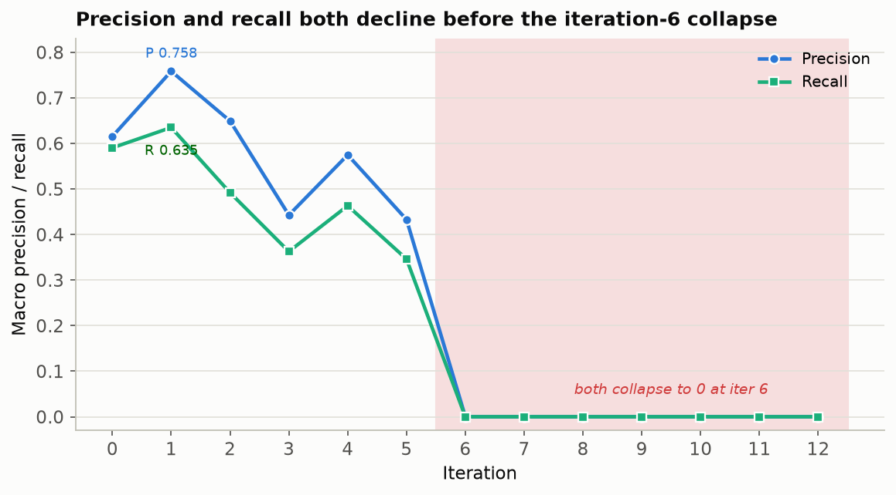

# An Intrinsic Attention-Routing Signal Unlocks Code Self-Modification but Does Not Guide It: A Pre-Registered Isolation Study

**Muzaffer Ozen**

*Idris Applied AI Research*

*July 2026*

---

## Abstract

Study 001 established that an autonomous claim-extraction agent with no consequence signal degrades its own performance monotonically and never modifies code, defaulting entirely to prompt edits. Study 002 tests a single candidate remedy in isolation: an **intrinsic cost signal** derived from the model's own attention distributions — *attention routing fidelity*, the fraction of extraction-time attention directed at results-bearing sentences — delivered to the agent as feedback in place of any external score. A **baseline correction** (explicit capability framing plus a worked code example) is applied alongside it and held constant for all subsequent studies. The study is pre-registered with five primary evidence criteria. Across the committed run of thirteen scanned iterations (0–12) on Qwen 3.6 27B, we find a mixed but ultimately negative result. The baseline correction succeeded: the agent modified `playground/extractor.py` at four iterations (3, 4, 6, 9), satisfying the pre-registered behavioral-differentiation criterion that Study 001 met at zero across all fourteen of its iterations. Under the letter of the locked decision rule this single passing criterion is a positive signal; we argue it is most parsimoniously assigned to the baseline correction rather than the routing signal, and report the study as a soft negative on that basis. The routing signal itself was inert as a guide: it declined from 0.023 to a frozen 0.0058 and never once read as improving, and the agent never reversed a code direction in response to it. At iteration 6 the agent refactored the extractor into a two-call XML pipeline whose internal instructions contradicted its own rewritten prompt, producing **zero claims on every abstract from iteration 6 through 12** — an extraction death that the routing signal, which measures attention over the model's input rather than the health of the downstream pipeline, reported as "flat" and unremarkable. Macro-F1 rose once (0.603 → 0.691 at iteration 1, from a prompt edit), then fell to 0.000 and stayed there. An operator-run offline replication (operator-reported, and not reproducible from the committed run files) found that even a *correctly implemented* version of the agent's chosen refactor scores 0.256 against 0.554 for leaving the extractor untouched, indicating the strategy had no win in it. We conclude that attention routing fidelity, as instantiated here, is not a sufficient intrinsic signal for productive self-modification: it did not differentiate a productive trajectory, and it was structurally decoupled from the quantity the agent was trying to improve.

**Keywords:** self-healing agents, intrinsic cost signal, attention routing, recursive self-modification, scientific claim extraction, negative results, pre-registration

---

## 1. Introduction

Study 001 of the Idris research program documented a clean failure mode: an autonomous agent given unrestricted access to its own extraction system, a frozen corpus, and episodic memory — but no external score — drove macro-F1 from 0.467 to 0.142 over fourteen iterations (0–13) without ever detecting its own decline (`experiments/study_001/paper.md`, lines 13, 199). The agent modified only prompt files across all fourteen iterations and never touched Python code. That paper attributed the failure to the absence of four structural components and framed a six-study isolation program to test each in turn.

Study 002 tests the first of those components: the **intrinsic cost signal**. Where an external signal asks "was the output correct," an intrinsic cost signal asks "was the processing that produced the output in a good state" (`experiments/study_002/pre-registration.md`, lines 33–35). The hypothesis is that a model attending to the right parts of an abstract — its results sentences rather than its methods or background — is more likely to extract correct claims, and that exposing this attentional state to the agent gives it something Study 001 lacked: feedback about the quality of its own processing, available without ground truth or scoring infrastructure (lines 37–39).

The research question, pre-registered before any harness code was written, is: *Does attention routing fidelity — an internal signal derived from model attention head distributions during extraction, computed without ground truth or external scoring — provide sufficient consequence signal to enable productive autonomous self-modification in a scientific claim extractor?* (`experiments/study_002/pre-registration.md`, lines 25–27). "Productive" is defined operationally as a measurably different trajectory from Study 001 on at least one of five pre-registered criteria (line 27; §2.5 below).

Study 002 differs from Study 001 in exactly two ways (`experiments/study_002/pre-registration.md`, lines 310–318): the intrinsic cost signal (the component under test) and a **baseline correction** — explicit capability framing plus worked before/after examples, including a complete runnable code example — that repairs a Study 001 confound in which the agent may never have understood it could write Python at all. The baseline correction is not under test; it is held constant across Studies 002 through 006 so that later cross-study comparisons are not confounded by capability framing.

---

## 2. Methods

### 2.1. Corpus and Task

The task, corpus, ground truth, and scorer are inherited unchanged from Study 001: extract atomic, explicitly-stated scientific claims from neuroscience abstracts drawn from NeuroSynth, scored by `rapidfuzz` token-sort-ratio matching at threshold 80, macro-averaged (`experiments/study_001/paper.md`, lines 35–55). Study 002 changes the corpus *sampling* structure but not its contents (`experiments/study_002/pre-registration.md`, lines 100–110). Each iteration runs on 25 abstracts: 10 fixed control abstracts (committed to `experiments/study_002/probe_set.json` before the study began, providing longitudinal accountability on the same items) and 15 impact abstracts drawn randomly per iteration. The full 200-abstract validation run was pre-registered to execute once at study end; as reported in §3, the run collapsed before that validation occurred.

### 2.2. The Intrinsic Cost Signal: Attention Routing Fidelity

Each abstract is segmented into sentences, and each sentence is classified as RESULTS, METHODS, or BACKGROUND by a fixed rule set (empirical-result verbs, comparison and statistical markers, and neuroimaging outcome terms mark RESULTS; procedural language marks METHODS) (`experiments/study_002/pre-registration.md`, lines 116–118). The extractor runs via `transformers` directly so that attention weights can be captured through forward hooks on the last 6 layers of Qwen 3.6 27B. The routing score for an abstract is the ratio of attention mass on results tokens to attention mass on all input tokens, averaged across captured layers and heads and ranging from 0 to 1 (lines 122–129). A score above 0.5 would indicate the model routes more than half its attention through results content.

The agent receives its full routing history every iteration — per-control-abstract scores and the aggregate — plus a natural-language translation of the delta since the prior iteration (which abstracts improved, which declined, the aggregate direction) (`experiments/study_002/pre-registration.md`, lines 131–133). The numbers are recorded; the agent is instructed to reason from the language. Crucially, the agent never sees F1 or ground truth. The routing signal is the only feedback available during iteration (lines 108).

### 2.3. Two-Call Iteration Structure

Each iteration runs two sequential passes (`experiments/study_002/pre-registration.md`, lines 137–157). Call 1 is a computation pass: the current extractor runs on all 25 abstracts, routing scores are computed, and the results are formatted into the natural-language signal. Call 2 is the modification decision: the agent receives the baseline-correction sections, episodic memory, current file contents, routing history, and the current routing signal, and emits an episode plus edit instructions. Edits are validated against a closed-by-default allowlist and applied; interface validation and a smoke test run before commit; then the extractor is re-run on the 10 control abstracts for a post-modification routing check. The pre- and post-modification routing scores, and their delta, are the consequence signal fed into the next iteration.

### 2.4. Agent, Model, and Modification Surface

The modifier agent is Qwen 3.6 27B, held constant from Study 001. For attention capture it runs via `transformers`; for the (never-reached) full validation it would run via llama.cpp (`experiments/study_002/pre-registration.md`, lines 181–187). The agent receives a plain, functional task description with no motivational framing — the configurator component is deliberately held at baseline so that Study 004 can test it in isolation (lines 161–169). The agent may modify `prompts/system_prompt.md`, `prompts/examples.md`, and any Python file in `playground/` (lines 173–177). Episodic memory is the basic Study 001 structure: `observation`, `hypothesis`, `action`, and a falsifiable `expectation` committed before the next iteration's scores are seen (lines 199–203).

### 2.5. Pre-Registered Evidence Criteria

The study produces a positive signal if any of five criteria is observed (`experiments/study_002/pre-registration.md`, lines 207–221):

1. **Routing improvement** — aggregate control-set routing increases monotonically or shows a net positive trend.
2. **Behavioral differentiation** — the agent attempts any code change (Study 001 produced zero).
3. **Self-correction** — the agent reverses a modification direction after observing negative routing consequences.
4. **Calibration** — the `expectation` field predicts routing outcomes above chance.
5. **Validation F1** — the final full-corpus F1 exceeds Study 001's 0.142.

A positive signal on any single criterion warrants a full follow-up study; a null result on all five is itself a significant finding, constraining the class of intrinsic signals likely to be effective (line 221).

### 2.6. Deviations from Pre-Registration

Four deviations, introduced by harness amendments during implementation, are logged in the pre-registration's amendment addendum (`experiments/study_002/pre-registration.md`, lines 355–386) and treated as threats to validity in §5. In brief: (D1) early-halt circuit breakers were added, overriding "no hard stops"; (D2) the agent's diagnostic call was windowed to the last 8 episodes rather than all prior, because full history overflowed the input budget; (D3) an implementation correction made the routing pass measure the input the committed extractor actually feeds the model; and (D4) `N_ITERATIONS` and the timeout were realigned to the pre-registered 20 and 30 minutes. None alters the research question, corpus, signals, or evidence criteria.

---

## 3. Results

### 3.1. F1 and Routing Trajectory

Table 1 reports per-iteration macro-metrics on the 25-abstract mini-corpus alongside the aggregate routing score and the modification surface touched. The committed run comprises thirteen scanned iterations, 0–12 (`experiments/study_002/metrics.jsonl`, lines 1–13; `routing_history.jsonl`, lines 1–13). A fourteenth modification decision (episode 13; `episodes.jsonl` line 13, `anomalies.jsonl` line 103) was aborted at the edit stage (`no_edits_proposed`) and produced no scan, so it does not appear in the trajectory.

| Iter | Macro-P | Macro-R | Macro-F1 | Claims/abs | Routing | Surface touched | Code? |
|------|---------|---------|----------|------------|---------|-----------------|-------|
| 0 | 0.615 | 0.590 | **0.603** | 5.40 | 0.0230 | (baseline) | — |
| 1 | 0.758 | 0.635 | **0.691** | 4.12 | 0.0188 | system_prompt.md | no |
| 2 | 0.649 | 0.492 | 0.560 | 4.20 | 0.0101 | system_prompt.md | no |
| 3 | 0.443 | 0.363 | 0.399 | 4.16 | 0.0094 | system_prompt.md + extractor.py | **yes** |
| 4 | 0.575 | 0.463 | 0.513 | 4.12 | 0.0094 | extractor.py | **yes** |
| 5 | 0.433 | 0.346 | 0.385 | 4.20 | 0.0067 | system_prompt.md | no |
| 6 | 0.000 | 0.000 | **0.000** | 0.00 | 0.0058 | extractor.py | **yes** |
| 7 | 0.000 | 0.000 | 0.000 | 0.00 | 0.0058 | (none) | no |
| 8 | 0.000 | 0.000 | 0.000 | 0.00 | 0.0058 | (none) | no |
| 9 | 0.000 | 0.000 | 0.000 | 0.00 | 0.0058 | extractor.py | **yes** |
| 10 | 0.000 | 0.000 | 0.000 | 0.00 | 0.0058 | (none) | no |
| 11 | 0.000 | 0.000 | 0.000 | 0.00 | 0.0058 | (none) | no |
| 12 | 0.000 | 0.000 | 0.000 | 0.00 | 0.0058 | (none) | no |

*Table 1: Per-iteration performance and routing. F1/precision/recall are macro-averaged over the 25-abstract mini-corpus. "Routing" is the aggregate post-modification routing score. Data: `experiments/study_002/metrics.jsonl` and `routing_history.jsonl`, lines 1–13.*

*Figure 1: The two signals on separate axes (deliberately not a shared dual axis, which would conflate their very different scales). The core visual claim of the study is here — at iteration 6 extraction quality falls off a cliff while the routing signal the agent was steering by barely registers the event and then flatlines. Figure generated directly from the committed JSONL by `experiments/study_002/make_figures.py`.*

Three features define the trajectory. First, the **only genuine improvement is iteration 1** (0.603 → 0.691), produced by a prompt edit before any code change. Second, from iteration 2 onward F1 declines under a mix of prompt and code edits, reaching **total extraction collapse at iteration 6** (F1 = 0.000, zero claims on all 25 abstracts; `experiments/study_002/anomalies.jsonl`, line 28) and remaining there through iteration 12. Third, the **routing signal is monotonically non-increasing and then freezes**: 0.023 at baseline down to 0.0058 from iteration 6 (with a plateau at iterations 3–4, both 0.00937), byte-identical across the dead iterations because the committed extractor never changed in a way that altered the measured attention.

The decline is driven by both halves of the F1 ratio, not a precision-recall trade (Figure 2). Precision and recall move together — up at iteration 1, then down in lockstep to the iteration-6 cliff — which is inconsistent with the Study 001 pattern of trading recall for precision and instead indicates the extractor was getting broadly worse, not narrower.

*Figure 2: Precision and recall decline together rather than trading off, then both collapse at iteration 6.*

Table 2 summarizes the verdict on each of the five pre-registered evidence criteria; the subsections that follow substantiate each row.

| # | Criterion (002-K) | Verdict | Evidence |
|---|-------------------|---------|----------|
| 1 | Routing improvement (net positive trend) | **Not met** | Aggregate routing fell 0.023 → 0.0058; `assessment_routing_trend` never once "improving" (§3.3) |
| 2 | Behavioral differentiation (any code change) | **Met** | `extractor.py` edited at iterations 3, 4, 6, 9 vs zero in Study 001 (§3.2) |
| 3 | Self-correction (reverse on negative feedback) | **Not met** | No rollback; monotonic commitment to one failing hypothesis (§3.4) |
| 4 | Calibration (expectation predicts routing above chance) | **Not met** | Near-verbatim wrong prediction repeated 13× (§3.5) |
| 5 | Validation F1 > 0.142 | **Not met (moot)** | Run died before validation; final-state F1 = 0.000 (§3.6) |

*Table 2: Pre-registered evidence-criteria scorecard. One of five criteria met. The single positive is behavioral and is most parsimoniously attributed to the baseline correction rather than the routing signal (§3.2, §4.3).*

### 3.2. Criterion 2 Satisfied: The Agent Modified Code

The clearest positive result is behavioral. Where Study 001 produced zero code changes across all fourteen of its iterations, Study 002's agent edited `playground/extractor.py` at iterations 3, 4, 6, and 9 (`experiments/study_002/metrics.jsonl`, `code_changes_attempted` = true at those iterations). This satisfies pre-registered criterion 2 (behavioral differentiation). Because the only design elements distinguishing Study 002 from Study 001 are the routing signal and the baseline correction, the code-change behavior is attributable to one or both — and the pre-registration anticipates exactly this ambiguity, defining criterion 2 as a change "attributable to the routing signal or the baseline correction" (`experiments/study_002/pre-registration.md`, line 213). The most parsimonious reading assigns it to the **baseline correction**: the agent was, for the first time, told in plain language that `playground/extractor.py` is "the Python function that runs for every abstract" and shown a complete runnable before/after code example (`experiments/study_002/pre-registration.md`, lines 63, 66–70). Study 003 onward, which retain the baseline correction, will indicate whether this behavior persists absent the routing signal.

**A note on the decision rule.** Pre-registration decision 002-K states that "a positive signal on any single criterion warrants full-scale investigation" (`experiments/study_002/pre-registration.md`, line 221). Criterion 2 was met, so under the letter of the locked rule Study 002 returned a positive signal. We nonetheless report a soft negative, and we flag this as a deliberate departure from the pre-registered decision procedure rather than an inference left to the reader: the sole passing criterion is a change we attribute to the baseline correction, which is held constant across all studies and is not the component under test, while the intrinsic cost signal — the actual object of the study — failed all four criteria that bear on it. Studies 003+ hold the baseline correction fixed and will confirm or overturn this attribution.

### 3.3. Criterion 1 Failed: Routing Never Improved

The aggregate routing score declined at every iteration through iteration 6 and was frozen thereafter (Table 1, Routing column). It never showed a net positive trend and never once read as "improving" — the harness-computed `assessment_routing_trend` field records "declining" or "flat" at every iteration and never "improving" (`experiments/study_002/metrics.jsonl`, `assessment_routing_trend`). Criterion 1 is unambiguously not met.

More striking is the *magnitude*: routing scores stay under ~2.5% throughout (0.023 at baseline, falling to ~0.6% in the dead tail), far below the 0.5 that would indicate results-focused attention. In absolute terms the model never directs more than about 2.3% of its input attention at results-classified tokens under any configuration the agent tried. The signal the agent was asked to optimize started near the floor and only went lower.

### 3.4. Criterion 3 Failed: No Self-Correction

The agent never reversed a *code* modification direction in response to negative routing feedback. From iteration 2 it settled on the theory that the extractor suffered from "attentional decay" and "grounding failure," and every subsequent action pursued ever-more-elaborate structural remedies — sentence classification, quote-first grounding, XML tagging, and finally a two-stage decomposition (`experiments/study_002/episodes.jsonl`, lines 2–13). After the iteration-6 collapse to zero claims, the agent spent iterations 7–12 attempting to repair its own broken two-stage pipeline, never entertaining that the refactor itself was the error and never rolling back to the working iteration-5 extractor.

Notably, the agent *did* waver at the meta level: at iterations 4 and 6 its assessments explicitly doubted the signal itself, judging that "attention was never the bottleneck; rather, the routing metric itself is likely misaligned … decoupled from the prompt's structural constraints" (`experiments/study_002/assessments.jsonl`). But this doubt never translated into a course reversal — the agent kept steering by the same metric it had just called misaligned, and kept building on the same failing refactor. So the accurate statement is narrower than "monotonic commitment": the agent oscillated in how it *interpreted* the signal while never reversing what it *did*. Either way, the routing signal, frozen at 0.0058, offered no evidence that the pipeline had died, so nothing in the agent's available feedback pushed it to abandon the direction.

### 3.5. Criterion 4 Failed: No Calibration

The agent's `expectation` fields are systematically wrong in a fixed direction. Beginning at iteration 1, essentially every expectation predicts that the next iteration will show routing "moving from ~0.03/0.07 to >0.30" and the intra-generation decay stabilizing to "near 0.00 or slightly positive" (`experiments/study_002/episodes.jsonl`, lines 1–13). The observed outcome was the reverse at every step: routing fell and then froze near 0.006. The expectation text is, moreover, verbatim-identical across iterations 2 through 13 (iteration 1's is a distinct paraphrase) — the agent re-committed the same failed prediction a dozen times without updating it against a dozen disconfirmations. This is not above-chance calibration; it is a stuck prior.

### 3.6. Criterion 5 Moot: No Validation Run

The pre-registered full 200-abstract validation run never executed: the run collapsed to zero-claim extraction at iteration 6 and never recovered, and the committed final state (iteration 12) is a dead extractor. The final-state F1 is therefore 0.000, below Study 001's 0.142. Criterion 5 is not met, though the comparison is degenerate — the endpoint is a broken pipeline, not a converged extractor.

### 3.7. The Iteration-6 Collapse in Detail

At iteration 6 the agent refactored `extractor.py` into a two-LLM-call pipeline: Stage 1 was to emit `<sentence type="results">` XML tags for the model to regex-scrape, and Stage 2 was to generate JSON claims from only the isolated results sentences. The refactor was internally self-contradictory. The agent had rewritten `system_prompt.md` to describe the two-stage process, but that prompt still ended by instructing the model to "output the JSON object only" — directly contradicting the Stage-1 injection demanding *only* XML. The model followed the stronger, terminal instruction, emitted JSON, the Stage-1 regex matched nothing, `results_sentences` came back empty, and every abstract returned zero claims (`experiments/study_002/anomalies.jsonl`, line 28: `zero_extraction_output`, 25 of 25 abstracts). The agent's own episodes from iteration 7 onward correctly diagnose fragments of this contradiction — noting the "prompt injection conflict" and the "context mismatch" (`episodes.jsonl`, lines 10, 12) — but repeated context truncation (§5.2) then prevented its corrective edits from ever materializing.

### 3.8. Offline Replication: The Strategy Had No Win

To separate "the agent implemented a good idea badly" from "the agent chose a bad idea," an operator-run offline experiment implemented the iteration-6 two-stage decomposition *correctly* — a non-contradictory Stage-1 XML prompt and a clean Stage-2 JSON prompt — and scored it against the naive single-call baseline on iteration 6's exact 25-abstract draw. This experiment is **operator-reported and is not reproducible from the committed run files**: it was executed outside the harness, its corrected implementation is not in the study's git history, and the numbers below cannot be independently regenerated from the committed artifacts. We report it because it bears directly on interpretation, and weight it accordingly. The corrected two-stage pipeline emitted parseable XML on all 25 abstracts (1–7 results sentences each), confirming a genuine implementation rather than another bug. It scored **macro-F1 0.256 (P 0.308 / R 0.219)** against the naive baseline's **0.554 (P 0.548 / R 0.559)** — a delta of −0.30 (Figure 3). Both precision and recall collapsed: the sentence-classification stage is a lossy bottleneck that drops content before extraction, and reformulating claims from isolated sentences drifts from ground-truth phrasing and fails fuzzy matching. The agent's chosen direction was well below simply leaving the extractor alone. The harness bugs (§5) determined *how catastrophically* the run failed — 0.000 for seven iterations rather than a merely-bad 0.256 — but not *whether* the strategy could have won. It could not.

*Figure 3: Offline operator replication on iteration 6's exact 25-abstract draw. This result is operator-reported and is not reproducible from the committed run files; the corrected implementation lives only in the offline replication, not in the study's git history (see §5.5). It is included because it distinguishes "bad execution" from "bad strategy," which is central to the interpretation.*

---

## 4. Discussion

### 4.1. A Signal Decoupled from What It Should Measure

The central negative finding is that attention routing fidelity, as instantiated, is **structurally decoupled from extraction quality**. The clearest evidence is iterations 6–12: extraction was completely dead — zero claims, F1 exactly 0.000 — while the routing signal read a placid, unchanging "flat" at 0.0058. A signal intended to tell the agent whether its processing was in a good state reported no alarm during the most catastrophic failure in the run.

The mechanism is that the routing measurement captures attention *over the input* during the model's first forward pass, which is largely insensitive to what the downstream extraction pipeline does with that attention. A two-stage pipeline that discards all results sentences before generating claims produces the same first-pass input attention as a healthy single-call extractor; the routing number cannot see the difference. This is not merely an implementation artifact (though §5.1 documents an implementation divergence that sharpened it) — it points to a deeper problem with the *class* of signal. Input-attention fidelity answers "is the model looking at the results sentences," which is upstream of and only loosely coupled to "does the extraction pipeline turn that attention into correct claims."

### 4.2. The Signal Was Not Just Uninformative — It Was Misleading

Study 001's failure was navigation without a compass: the agent had no consequence signal at all. Study 002's failure is subtler and arguably worse: the agent had a compass pointing the wrong way. Because routing declined under the agent's early edits, and because the agent was told to treat low routing as the problem to solve, it spent the entire run chasing a number that had little to do with claim quality. Its "attentional decay" hypothesis — coherent, repeated, and elaborated across thirteen episodes — was an artifact of over-interpreting a tiny, noisy signal (routing values under ~2.5%, with intra-generation deltas of comparable size). A signal near its own floor invites the agent to read structure into noise, and this agent did exactly that, then committed to the reading with no mechanism to disconfirm it.

### 4.3. Capability Framing Is Necessary but Not Sufficient

The baseline correction worked as intended and addresses Study 001's central confound: told plainly that it could write Python and shown how, the agent wrote Python. This is a genuine, reportable positive, and it makes capability framing the most parsimonious explanation for Study 001's prompt-only behavior — pointing to an orientation failure rather than a capability ceiling. We stop short of "isolates": Study 002 changed two variables at once (§5.5), so this run cannot by itself rule out a contribution from the routing signal; Studies 003+, which retain the baseline correction without a routing signal, are what will confirm the attribution. But unlocking code modification without a signal that makes code-change consequences *visible* simply gave the agent a longer rope. Its most consequential code change (the iteration-6 refactor) was also its most destructive, and the routing signal was blind to the destruction. Capability plus a decoupled signal is not obviously safer than capability alone.

### 4.4. Relation to the Study 001 Failure Mode

Study 001 named the failure "description-without-experience collapse": the agent could describe good extraction but never feel the consequences of its decisions (`experiments/study_001/publish-paper.md`, lines 239–243). Study 002 tried to supply the missing feeling in the form of an intrinsic signal. The result suggests that not any internal signal will do: an intrinsic signal only substitutes for experience if it is *coupled to the outcome that matters*. Attention routing fidelity is internal, cheap, and ground-truth-free — the properties the program wants — but it fails the coupling requirement, and so it reproduces the Study 001 dynamic (monotonic degradation, systematic mis-calibration, no self-correction) rather than breaking it.

### 4.5. Implications for the Isolation Program

For the broader six-study arc, Study 002 delivers two usable results. The behavioral one — capability framing produces code changes — is a clean positive that will now be held constant, so later studies inherit an agent that will actually use the full modification surface. The signal one is a bounded negative: attention-over-input routing fidelity is not a sufficient intrinsic cost signal. This does not indict intrinsic signals as a class; it constrains it. A useful intrinsic signal likely needs to be computed over the model's *output-generating* pass or over the *pipeline's behavior*, not over its input attention — a design lesson for any future intrinsic-signal study.

---

## 5. Limitations and Instrumentation Threats to Validity

Study 002's negative result is partly entangled with harness instrumentation defects, several of which were discovered and amended across the implementation (amendment series A004–A009; `dev-history/s2-007` through `s2-012`). We treat these as first-class threats to validity. Distinguishing what the study *establishes* from what the instrumentation *confounds* is essential to reading the result correctly.

### 5.1. Routing Measured Over Input, Not the Full Pipeline

The routing signal is computed from attention during a forward pass over the model's input, and in earlier builds — before amendment A009-1 — did not invoke the committed `extract()` function at all (`experiments/study_002/pre-registration.md`, lines 379–383, D3). Pre-registration decision 002-E (line 141) specifies that routing runs "the current extractor." This run executed **with A009-1 active**, so routing was measured over the input the committed extractor actually feeds its first model call — the pre-registration-faithful behavior. Yet the signal still did not respond to the agent's code edits. The direct evidence is in `routing_history.jsonl`: iteration 4 was an `extractor.py`-only edit (`metrics.jsonl`, line 5), and its aggregate and per-abstract routing scores are **byte-identical to iteration 3's** (both 0.009366872215545337, `routing_delta = 0.0`); iteration 9, also an `extractor.py`-only edit, likewise produced `routing_delta = 0.0`.

The reason is instructive, and it is the point of §4.1: A009-1 corrected *where* attention is measured (the extractor's first model call) but not the deeper limitation that attention over the *input* to that first call is upstream of everything the agent's edits actually changed. Iterations 4 and 9 modified downstream response parsing and pipeline logic — how the model's output is post-processed — not the text handed to the first model call, so a signal watching first-call input attention correctly registered no change while the extraction result changed underneath it. The bug (measuring the wrong call) was real and is fixed; the residual decoupling (measuring input attention rather than the pipeline's behavior) is a property of the signal *design* and survives the fix. This is why the signal read "flat" through the iteration-6 collapse.

### 5.2. Context Truncation Suppressed the Agent's Corrective Edits

The single largest driver of the frozen zero-claim tail (iterations 7–12) is aggressive context truncation. The agent's prompts grew to 7,000–8,700 tokens against a 5,120-token input budget, and the truncation kept the tail of the message (files and schema) while discarding the varying head, repeatedly cutting off the agent's edit blocks (`experiments/study_002/anomalies.jsonl`, dozens of `context_truncated` events; `no_edits_proposed` at iterations 7, 8, 10, 11, 12, 13). The agent frequently diagnosed its own bug correctly and then failed to emit the fix because the fix was truncated away. This means the run's *duration in the dead state* is an instrumentation artifact: a healthy context budget would likely have let the agent apply edits, though — per §3.8 — those edits were pursuing a losing strategy regardless.

### 5.3. No Dead-Extractor Guard

The harness has no breaker that halts or rolls back when extraction produces ~100% zero-claim output. The `zero_extraction_output` anomaly is logged but toothless (`experiments/study_002/anomalies.jsonl`, lines 28, 39, 50, 60, 71, 82, 93), and the smoke test passed at iteration 6 with a claim count of zero. The existing breakers did not fire: the no-progress breaker was reset by iteration 9's applied (but still zero-producing) edit, and the routing-stall breaker's window admits only applied-edit iterations. A single guard requiring the smoke test to produce at least one claim would have caught the iteration-6 commit before it entered the record. This defect converted a bad iteration into eight dead ones.

### 5.4. Signal Magnitude and Noise

The routing values throughout are under ~2.5% of input attention (and ~0.6% in the dead tail), with intra-generation deltas of similar magnitude. At this scale the signal is plausibly dominated by measurement noise, and the natural-language translation the agent consumed ("declining," "flat") imposed categorical structure on differences that may not be meaningful. The study cannot distinguish "the agent failed to use a real signal" from "there was no real signal to use," and the near-floor magnitude favors the latter.

### 5.5. Standard Caveats

**Single run (n=1).** Results are from one execution of a nondeterministic model; exact values will not replicate, though the directional findings (routing never improves, no self-correction, capability framing yields code edits) are structural. **Single model.** All results are specific to Qwen 3.6 27B; a stronger model might implement its refactors without contradiction or read the tiny routing signal differently. **Endpoint.** The committed record ends at iteration 12 of a pre-registered 20 (with a fourteenth decision, episode 13, aborted at the edit stage). Notably, *no early-halt breaker fired* on the dead extractor — the existing breakers each missed it for the reasons detailed in §5.3 — so the run did not halt itself; it was terminated in the zero-claim state rather than stopping on a recorded condition. Iterations 7–12 simply reproduce the zero state and add no behavioral signal. That a fully dead extractor ran for seven iterations without tripping any breaker is itself the §5.3 instrumentation gap, not an orderly early stop. **Two-variable change from Study 001.** Study 002 differs from Study 001 on both the routing signal and the baseline correction, so its comparison to Study 001 cannot cleanly attribute effects to the signal alone — but Studies 003+ hold the baseline correction constant, isolating the signal in the forward direction.

---

## 6. Conclusion

Study 002 asked whether an intrinsic attention-routing signal is enough to make autonomous self-modification productive. The answer is no, with an informative structure. The baseline correction succeeded plainly: explicit capability framing turned Study 001's prompt-only agent into one that modified its own extraction code, satisfying the pre-registered behavioral-differentiation criterion and making capability framing — not a capability ceiling — the most parsimonious explanation for Study 001's code-avoidance (an attribution Studies 003+ will confirm, since two variables changed here). But the routing signal failed on all four of its remaining criteria. It never improved, it prompted no self-correction, it was predicted with a stuck and systematically wrong prior, and it left the final extractor dead. Its deepest failure was to report "flat" through seven iterations of totally broken, zero-claim extraction, because it measures attention over the input rather than the health of the pipeline that consumes it.

The result is a soft negative. Attention routing fidelity, as instantiated here, is not a sufficient intrinsic cost signal — not merely because the harness that measured it had bugs (it did, and §5 documents them), but because the signal is structurally decoupled from the extraction quality it was meant to proxy. An offline replication confirms that the agent's chosen direction had no win in it even when implemented correctly. For the isolation program, the lesson is a constraint rather than a dead end: an effective intrinsic signal must be coupled to the model's output-generating behavior, not its input attention. Study 003 proceeds with the baseline correction retained and the intrinsic-signal question sharpened by what routing fidelity could not do.

---

## References

1. `experiments/study_002/pre-registration.md` — Pre-registered study design, decisions 002-A through 002-L, and amendment addendum D1–D4. Idris Applied AI Research, June–July 2026.

2. `experiments/study_002/metrics.jsonl` — Per-iteration programmatic metrics, iterations 0–12: precision, recall, F1, routing scores, code-change flags, token counts.

3. `experiments/study_002/routing_history.jsonl` — Per-iteration, per-abstract routing scores with start/end and intra-generation deltas.

4. `experiments/study_002/episodes.jsonl` — Agent episodic memory: observation, hypothesis, action, expectation per iteration (13 episodes).

5. `experiments/study_002/assessments.jsonl` — Per-iteration routing-signal assessments consumed by the agent (routing trend, last-action effect, pattern observed).

6. `experiments/study_002/anomalies.jsonl` — Structured anomaly events: context truncation, zero-extraction output, no-edits-proposed.

7. `experiments/study_002/probe_set.json` — The 10 fixed control abstract IDs, committed before the study began.

8. `experiments/study_001/paper.md` — Study 001 results and three-phase failure analysis.

9. `experiments/study_001/publish-paper.md` — Study 001 publication draft: description-without-experience failure mode and the four-component / RDE framing.

10. `dev-history/s2-007` through `dev-history/s2-012` — Harness amendment specifications A004–A009 (extraction repair, circuit breakers, edit conditioning, crash recovery, output-stall breaker, and the audit consolidation that corrected routing measurement).

---

*Study 002 — Idris Applied AI Research*
*Pre-registration integrity anchor: `experiments/study_002/pre-registration-proof.txt`*
